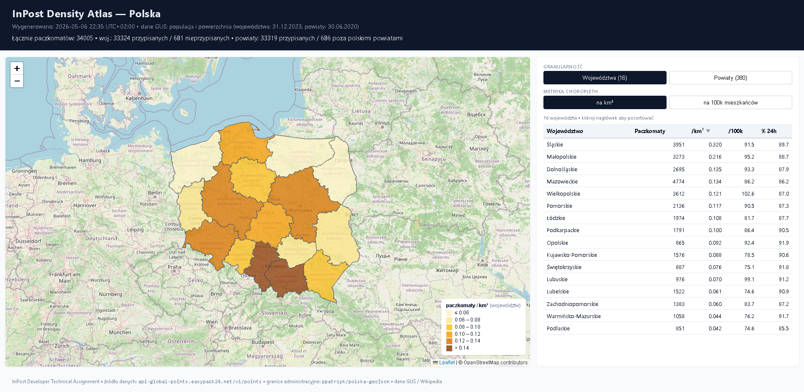
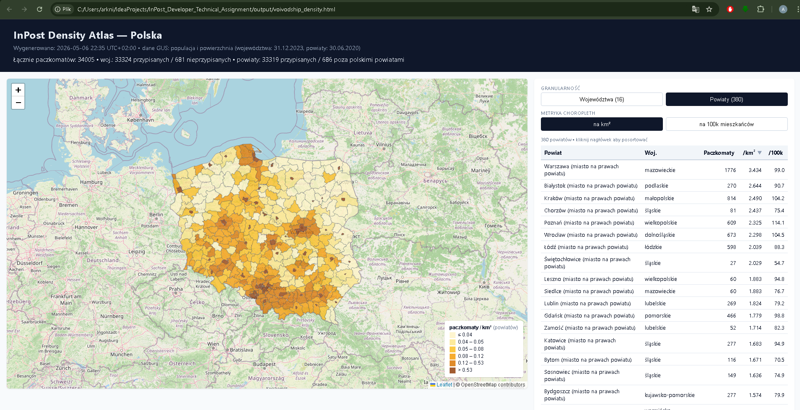
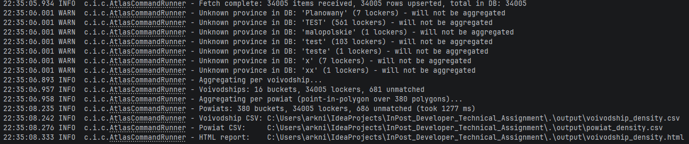

# InPost Density Atlas — Polska

> Coverage density analysis of the InPost parcel locker network in Poland —
> pulled from the public points API, joined with GUS reference data, and
> rendered as CSVs + a standalone Leaflet choropleth that toggles between
> two granularities: 16 voivodships and 380 powiats.

## Author

- **Name:** Arkadiusz Niedzielski
- **Email:** arknie08576@wp.pl

## Overview

A small batch/CLI app that fetches every Polish InPost parcel locker from the
public `/v1/points` API, joins them with GUS administrative-boundary and
population data, and produces a coverage-density report at two granularities
(voivodship and powiat). The output is two CSVs plus a single self-contained
HTML choropleth that answers, with a click on a toggle, *"where is the InPost
network actually concentrated, and where are the gaps?"*

## Demo & Description

**Sample outputs** from a recent `--all` run are committed in `output/`, so you can preview the CSVs and open the standalone HTML choropleth directly in a browser without running the pipeline yourself.



The brief leaves the angle to the candidate. Most submissions will be a smart
finder over the API. I deliberately took a different angle: an analytical
pipeline that surfaces **where coverage concentrates and where it doesn't** —
the question a logistics operator actually asks about its own network.

**Pipeline (one process, three stages):**

1. **Fetch** — `InPostClient` paginates `country=PL` from
   `https://api-global-points.easypack24.net/v1/points` (per_page=500, ~68
   pages, ~33,9k lockers), with hand-rolled exponential backoff on 5xx /
   network errors. Rows are upserted into a local SQLite file in batches.
2. **Aggregate** — at two granularities:
   - **Voivodship**: groups lockers by `address_details.province` after
     normalization (lowercase + trim; diacritics preserved to match GUS).
     16 buckets. ~664 test rows (`province="TEST"` etc.) and a handful of
     one-off oddities are flagged in the run log and excluded.
   - **Powiat**: the API has no powiat field, so we compute it via
     point-in-polygon against the 380 powiat polygons, using a JTS STR-tree
     spatial index. Done on the fly during `--analyze` (~950 ms for the
     full PL dataset) — the `lockers` table stays unchanged.
   - Both layers compute: locker count, density per km², density per 100k
     inhabitants, share of 24/7 lockers, share of accessible lockers, and
     dual rankings.
3. **Report** — three artefacts in `./output/`:
   - `voivodship_density.csv` — 16-row flat table
   - `powiat_density.csv` — 380-row flat table
   - `voivodship_density.html` — single self-contained HTML with a Leaflet
     choropleth, **toggleable between the voivodship and powiat layers**,
     sortable table, and tooltip drill-down. Open it in a browser, no
     server required.

**Architecture (`com.inpostatlas.*`):**

```
        InPost API              CSV + GeoJSON reference
            │                     (woj. + powiat)
            ▼                              │
      InPostClient                         │
       (paginated,                         │
        retry+backoff)                     │
            │                              │
            ▼                              │
       SQLite (lockers)                    │
            │                              │
            ├─────► VoivodshipAggregator ◄─┤
            │                              │
            └─────► PowiatAggregator     ◄─┘
                          ▲
                          │ uses
                    PowiatAssigner (JTS STR-tree, point-in-polygon)
                          │
            ┌─────────────┴───────────────┐
            ▼                             ▼
       CsvReportWriter            HtmlReportWriter
       PowiatCsvReportWriter      (single file, two togglable layers)
```

| Package | Responsibility |
|---|---|
| `api` | HTTP client + DTOs + retry policy |
| `storage` | SQLite repository, batch upsert, mapping |
| `reference` | GUS / Wikipedia loaders + JTS GeoJSON parser for both layers |
| `analysis` | Voivodship aggregator, powiat aggregator, JTS-based `PowiatAssigner`, province normalizer |
| `report` | CSV writers (voivodship + powiat) and the HTML choropleth writer |
| `cli` | `CommandLineRunner`-based entry point |

**More screenshots:**



*Powiat layer active, with a tooltip showing the per-bucket metrics on hover.*



*Terminal output of `--all`: ~34k lockers fetched, 16 voivodship buckets and 380 powiat buckets aggregated, CSV + HTML written.*

## Technologies

- **Java 21 + Spring Boot 3.5** — Java records for DTOs, sensible auto-config
  for `RestClient` + `JdbcTemplate`. No web starter — this is a CLI/batch app,
  not a service.
- **Spring `RestClient`** — modern blocking API in Spring Web 6.x; fits the
  synchronous, paginated workload better than `WebClient`.
- **SQLite via xerial JDBC** — zero-infra; one file; easy to inspect from any
  SQLite client; ideal for demo. No schema migrations needed when adding the
  powiat layer.
- **JTS Topology Suite 1.20** — STR-tree spatial index + `Geometry.contains`
  for the point-in-polygon powiat assignment. Lighter than a database
  extension or a service-side spatial join.
- **Jackson** — JSON parsing for both the API and the GeoJSON reference data.
- **Leaflet 1.9.4 (CDN) + OpenStreetMap tiles** — for the standalone HTML
  choropleth. Both GeoJSON layers and both metrics arrays are embedded in
  the file — no fetch on load.
- **JUnit 5 + AssertJ + Mockito** — unit tests for the aggregators, the
  province normalizer, and the powiat assigner.
- **WireMock** — HTTP integration test for `InPostClient` covering pagination,
  retry-on-5xx, and the `_links.next` fallback path.
- **Maven (Maven Wrapper bundled)** — single `./mvnw clean package` builds
  a fat jar.
- **Python 3 (`scripts/build_powiats_csv.py`)** — one-off generator that
  fetches the Polish Wikipedia table, parses it, applies post-2021 name
  aliases, cross-validates against the GeoJSON, and writes the CSV. Output
  CSV is committed; the script is included so the data can be regenerated.

## How to run

### Prerequisites

- **JDK 21** or later (the project targets 21).
- A modern browser to open the HTML report (Chrome / Firefox / Edge).
- Internet access at runtime (the `--fetch` stage hits the InPost API; the
  HTML uses Leaflet + OSM tiles via CDN).
- The Maven Wrapper is included; **no system Maven needed**.
- Optional: Python 3.11+ if you want to regenerate `powiats.csv` from
  Wikipedia via `scripts/build_powiats_csv.py`.

### Build & run

```bash
# 1. Clone
git clone <your-repo-url>
cd InPost_Developer_Technical_Assignment

# 2. Build + run tests (produces target/inpost-atlas-0.1.0-SNAPSHOT.jar)
./mvnw clean package

# 3. Print help
java -jar target/inpost-atlas-0.1.0-SNAPSHOT.jar --help

# 4. Full pipeline: fetch → analyze → write CSV + HTML
java -jar target/inpost-atlas-0.1.0-SNAPSHOT.jar --all

# 5. Or run stages separately
java -jar target/inpost-atlas-0.1.0-SNAPSHOT.jar --fetch          # ~1–2 min, ~33k lockers
java -jar target/inpost-atlas-0.1.0-SNAPSHOT.jar --analyze --report
```

Outputs land in `./output/`. The local DB lives at `./atlas.db` (gitignored).
Re-running `--fetch` upserts on `name`, so subsequent runs are idempotent.

Open `output/voivodship_density.html` in any modern browser.

> **Windows note.** The bundled Maven Wrapper downloads Maven on first run
> via `curl`, and Schannel may reject the cert with `CRYPT_E_NO_REVOCATION_CHECK`.
> Workarounds, in order of effort: install a system Maven and use `mvn` instead
> of `./mvnw`; set `MVNW_REPOURL` to a mirror your machine trusts; or run the
> wrapper from PowerShell with `$env:MAVEN_WRAPPER_USE_CURL_INSECURE=1` if you
> patch the script. The project itself has no Windows-specific behaviour —
> only the wrapper download path does.

## What I would do with more time

In rough priority order:

1. **Population-weighted accessibility** — % of population within X km of a
   24/7 + accessible locker. This would surface coverage *gaps* better than
   raw density, which currently rewards small dense urban powiats and
   penalises large rural ones uniformly.
2. **Time-series snapshots** — schedule the `--fetch` stage on a cron, store
   each snapshot, and track network growth per voivodship and per powiat
   over time. The `lockers` table already has `fetched_at` per row; the
   missing piece is a snapshot table and a delta report.
3. **Refresh the powiat reference dataset** — the Wikipedia table used here
   is from 30.06.2020. Top-10 per-100k commuter belts have grown notably
   since. The `build_powiats_csv.py` generator script makes this a small
   chore, not a rewrite.
4. **Bigger Europe view** — the API serves ~153k points across ~14 countries.
   Per-country reference data quality varies, but a "PL vs DE vs FR" coverage
   comparison would be a natural next step. Cut from scope on a 3-day deadline.
5. **Replace the hand-rolled retry with Resilience4j** — only worth it if a
   second endpoint or a more complex policy (circuit breaker, bulkhead) gets
   added. Today, one retry policy on two exception types doesn't justify the
   dependency.
6. **Containerise** — a `Dockerfile` + a published image so a reviewer can
   run the pipeline without a local JDK.

## AI usage

Yes — AI was a heavy part of the build. I used **Claude (Anthropic)** as
a pairing partner throughout, and I want to be straightforward about the
shape of that collaboration rather than downplay it.

- **What Claude helped with:** scaffolding the Spring Boot setup, drafting
  the DTO layer from the observed API response shape, writing the JTS-based
  `PowiatAssigner` (point-in-polygon, STR-tree, the JTS coordinate-order
  trap), the WireMock integration test for the paginated client, the
  `build_powiats_csv.py` generator, and most of the iteration on the Leaflet
  HTML template (including the layer-toggle plumbing).
- **What I owned:** the framing — picking *coverage density* over a smart
  finder, picking voivodships + powiats over gminas, choosing on-the-fly
  point-in-polygon over a denormalised column, and rejecting Resilience4j +
  WebClient as overengineering. Those calls and their justifications are
  spelled out in the *Decisions log* and *Rejected paths* sections below.
  When Claude pushed for a heavier solution, I pushed back.
- **How I verified:** the unit tests (aggregators, normalizer, assigner) and
  the WireMock integration test catch the parts most likely to break. Beyond
  that, every change went through `--all` against the live API — the CSVs
  and the rendered HTML are how I caught real issues (e.g. the duplicate
  `nazwa` collision between `średzki`/`świdnicki`, which forced the
  voivodship-aware join key).

## Anything else?

### Decisions log

| Decision | Choice | Reason |
|---|---|---|
| Geography | Poland only | GUS data trivially available; depth > breadth on a 3-day deadline. |
| Granularity (voivodship) | 16 voivodships | The API returns `address_details.province` per locker, so no point-in-polygon work is needed. Normalization handles inconsistent casing. |
| Granularity (powiat) | 380 powiats via point-in-polygon | The API has no powiat field, so we compute it. Done on the fly during `--analyze` rather than denormalised into the `lockers` table. |
| Powiat assignment | JTS STR-tree + `Geometry.contains` | Build phase loads 380 polygons once; query phase is ~1 ms per locker. Lighter than a database extension or a service-side spatial join. |
| Powiat join key | `"<geojsonNazwa>__<voivodship>"` | Two GeoJSON features share `nazwa`: `średzki` and `świdnicki` each appear in two voivodships. Disambiguate by combining name with the parent voivodship. |
| Stack | Spring Boot 3.5 on Java 21 | Java records for DTOs, sensible auto-config for `RestClient` + `JdbcTemplate`. No web starter — this is a CLI/batch app. |
| Persistence | SQLite (xerial JDBC) | Zero-infra; one file; easy to inspect; ideal for demo. |
| HTTP client | Spring `RestClient` | Modern blocking API in Spring Web 6.x; fits the synchronous, paginated workload better than `WebClient`. |
| Retry policy | Hand-rolled exponential backoff (max 4 retries) | Did not pull in Resilience4j just to retry one method on two exception types. |
| Map rendering | Standalone HTML + Leaflet via CDN | One file the reviewer can double-click. Renders without a server. Both GeoJSON layers and both metrics arrays are embedded — no fetch on load. |
| Testing | JUnit 5 + AssertJ + Mockito for unit; WireMock for HTTP integration | Pagination, retry, the JTS coordinate-order trap, and reference-data joins are the parts most likely to break — that's where the tests focus. |

### Rejected paths

- **Live availability tracker** — `locker_availability` always returns
  `NO_DATA` in the public API. Sampled 500 Warsaw lockers; every single one
  came back `NO_DATA`. Not a real signal.
- **Smart finder using `recommended_low_interest_box_machines_list`** — the
  obvious play, which is why I picked the analysis route instead.
- **Cross-country comparison (PL vs DE vs FR vs …)** — too wide for the
  deadline; per-country reference data quality would vary.
- **Gmina-level granularity (~2,500 buckets)** — at that scale individual
  locker placements become statistical noise (one new locker shifts a small
  gmina from #2,000 to #800), and the reference-data effort is a project of
  its own. Powiat is the last meaningful granularity for a coverage analysis.
- **Resilience4j + WebClient + a reactive pipeline** — overengineered for
  one endpoint with predictable pagination.
- **Storing the powiat key in the `lockers` table** — would require a schema
  migration step and re-fetching the whole dataset on every reference-data
  update. On-the-fly is ~1 second for the full PL dataset.

### Findings worth noting

- **Total points returned by the API: ~153k** across FR, GB, DE, ES, IT,
  PT, BE, NL, CZ, SK, HU, AT, RO, … . The brief says 90k+ — the network
  has grown.
- **Poland: 33,961 points** as of the run that produced the bundled CSV.
  Pagination at `per_page=500` means 68 pages, ~3 min end-to-end.
- **The API response shape is `{count, page, per_page, total_pages, items, …}`**
  — no `_links.next` HAL block, contrary to what some older docs suggest.
  `InPostClient` paginates on `total_pages` and falls back to
  `_links.next.href` if the schema changes again.
- **The public dataset contains ~664 test rows** (`province` = `"TEST"` /
  `"test"`) plus oddities (`"Planowany"`, `"x"`, `"xx"`, `"teste"`, and one
  `"malopolskie"` typed without the diacritic). Flagged in the run log as
  `Unknown province` and excluded — they surfaced because the analysis
  JOINs on a closed set of 16 keys.
- **`locker_availability` is dead in the public feed.** Don't build on it.
- **Voivodship-level top-line:** Śląskie leads on density per km² (0.32);
  Wielkopolskie leads on density per 100k inhabitants (102.65); Podlaskie
  is bottom on both. Lubuskie ranks #2 per capita thanks to a small
  population.
- **Powiat-level top-line:**
  - **Density per km²** is dominated by *miasta na prawach powiatu*. Top 5:
    Warszawa (3.44/km²), Białystok (2.60), Kraków (2.49), Chorzów (2.41),
    Poznań (2.33).
  - **Density per 100k people** flips the picture — the densest 10 are all
    *suburban / commuter-belt powiats*, clustering in three voivodships:
    *wolsztyński* (133.8), *nowotomyski* (133.5), *poznański* (131.4),
    *leszczyński* (128.6), *wrocławski* (127.4), *gdański* (122.3),
    *wielicki* (120.8), *pucki* (120.4), *trzebnicki* (115.9), *krakowski*
    (115.6).
  - **Bottom 5 per km²** are eastern-border powiats: *bieszczadzki* (0.012),
    *moniecki* (0.014), *suwalski* (0.014), *sejneński* (0.015),
    *sokólski* (0.018) — sub-1 locker per 50 km².

### Data sources & attribution

- Locker positions: `https://api-global-points.easypack24.net/v1/points`
  (InPost public API, no authentication required).
- Population & area per voivodship: GUS (Główny Urząd Statystyczny),
  state on 31.12.2023.
- Population & area per powiat: Polish Wikipedia article *Lista powiatów
  w Polsce*, state on 30.06.2020 (sourced from GUS BDL but more convenient
  to scrape). The CSV is committed; you can regenerate it via
  `python scripts/build_powiats_csv.py`.
- Voivodship boundaries: `github.com/ppatrzyk/polska-geojson`
  (`wojewodztwa-min.geojson`).
- Powiat boundaries: same repository, `powiaty-min.geojson` (380 features).
  Pre-2021 *"powiat jeleniogórski"* is aliased to current *"powiat
  karkonoski"* in `build_powiats_csv.py`.
- Map tiles: OpenStreetMap contributors. Map library: Leaflet 1.9.4.
- JTS Topology Suite 1.20.0 for the spatial index and point-in-polygon test.
